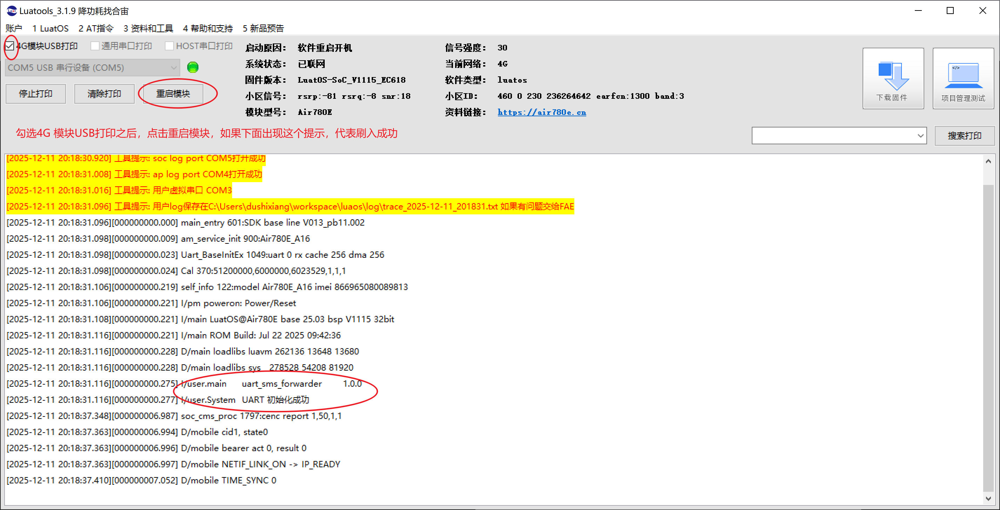

# Air780E 短信UART转发器

基于 Air780E 设备的短信转发系统，支持接收短信并通过串口转发到上位机。

## 🌟 功能特性

- 📱 自动接收短信并转发到串口
- 🔄 支持双向通信（可通过串口发送短信）
- 📊 JSON格式数据传输
- 💾 消息缓存机制（最多50条）
- 🐕 看门狗保护
- 💓 心跳状态上报
- 🛡️ 错误处理和内存管理

## 🚀 快速开始

### 1. 硬件准备

**Air780E 设备准备**：
- 插入有效的SIM卡
- 通过USB连接电脑

**固件要求**：
- Air780(EC618) v1003 及以上版本固件

### 2. 烧录 Lua 脚本

使用 **LuaTools** 烧录 `main.lua` 脚本：


### 3. 测试



### 4. 运行上位机程序

下载 release 中的二进制文件 `uart_sms_forwarder.exe`

```bash
# 进入项目目录

```

